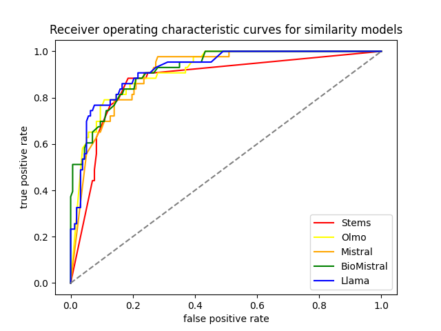
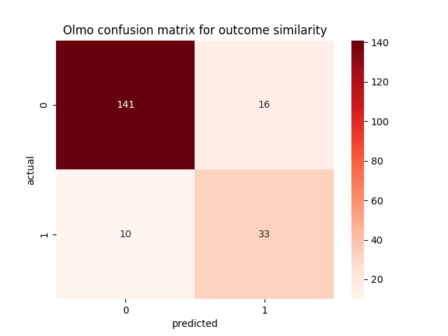
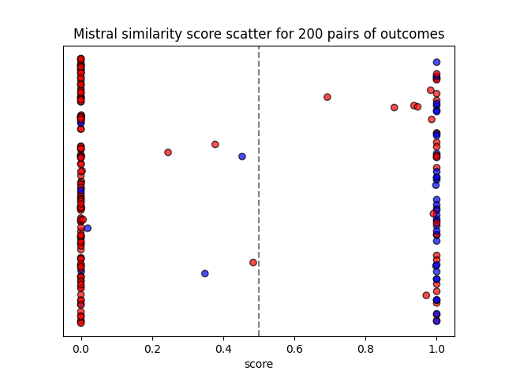
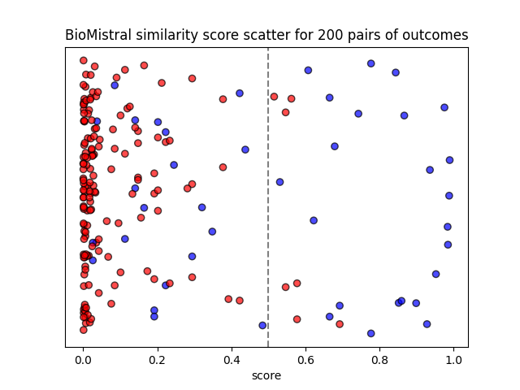
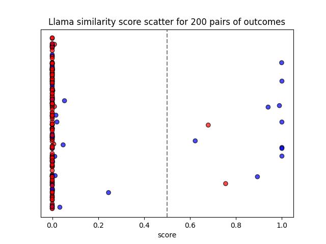

# Detecting spin in clinical trials with large language models

Full thesis: https://repozitorij.uni-lj.si/IzpisGradiva.php?id=169018

_Abstract: Spin in research reports includes reporting practices that distort the presentation of results. This is particularly critical in medicine, where spin is present in more than 50% of randomized controlled trials (RCT) that fail to reach the threshold of statistical significance. Comparing declared and reported outcomes is crucial for detecting various types of spin, such as selective reporting. We developed a system for automatic detection of spin in clinical trials. We used 300 pairs of outcomes, labeled with semantic similarity. We evaluated baseline statistical models, masked language models (MLM) and generative large language models (LLM). We generated similarity scores and used Youden index to determine the classification threshold. The proposed approach to comparing outcomes using LLMs involves prompt engineering, generating similarity scores based on token probabilities and majority voting. The results on the test set of 2500 examples, with 90% accuracy and F1 score of 78%, outperform dedicated models for semantic similarity evaluation, but trail behind fine-tuned versions of BERT model. An advantage of our approach is the ability to generate explanations for the classified examples._

🆕 2026 update: We evaluated MedGemma-4b-it and got results similar to BioMistral. Maybe this model would be useful for
explaining medical terminology and classified examples.

## Language models

### OLMo-7B-Instruct
- Description: **Open training** and weights general purpose model.
- Model size: 6.9B parameters
- Vocabulary size: 50k tokens
- Release date: February 2024
- Link: https://huggingface.co/allenai/OLMo-7B-Instruct-hf

### Mistral-7B-Instruct-v0.2
- Description: Open weights general purpose model.
- Model size: 7.2B parameters
- Vocabulary size: 32k tokens
- Release date: December 2023
- Link: https://huggingface.co/mistralai/Mistral-7B-Instruct-v0.2

### BioMistral-7B-DARE
- Description: Open weights medical **domain adapted** model.
- Model size: 7.2B parameters
- Vocabulary size: 32k tokens
- Release date: February 2024
- Link: https://huggingface.co/BioMistral/BioMistral-7B-DARE

### MedGemma-4b-it
- Description: Trained for performance on medical text and images.
- Model size: 4.3B parameters
- Release date: May 2025
- Link: https://huggingface.co/google/medgemma-4b-it

### Meta-Llama-3-8B-Instruct
- Description: **State of the art** open weights model.
- Model size: 8B parameters
- Vocabulary size: 128k tokens
- Release date: April 2024
- Link: https://huggingface.co/meta-llama/Meta-Llama-3-8B-Instruct

### Gpt-4-Turbo
- Description: Closed weights API model.
- Model size: Not disclosed
- Vocabulary size: Not disclosed
- Release date: April 2024
- Link: https://platform.openai.com/docs/models/turbo#gpt-4-turbo-and-gpt-4


## Dataset

- Labeled pairs of primary and reported outcomes of PubMed clinical trial abstracts.
- 100 pairs for few shot examples and threshold tuning.
- 2600 pairs for prompt tuning and model evaluation.
- Biased towards **negative examples**, where the reported outcome does not match the primary outcome.

<div style='display: flex; justify-content: center;'>
    
</div>

> **Note**: Authors of the original paper used 3043 pairs of outcomes. After deduplication by attributes 
> `out1`, `out2` and `label` the dataset consists of 2796 rows.


## Prompt templates

### Zero shot

- Sentence template:
```text
<|endoftext|><|user|>
Are the sentences semantically similar? Answer with either Yes or No.

First sentence: {out1}

Second sentence: {out2}

Answer:
<|assistant|>
```

- Outcome template:
```text
<|endoftext|><|user|>
Does the reported outcome match the defined primary outcome? Answer with either Yes or No.
                                                
Primary outcome: {out1}

Reported outcome: {out2}

Answer:
<|assistant|>
```

- Role template:
```text
<|endoftext|><|user|>
You are a clinical trial report reviewer. Your task is to detect incorrectly reported outcomes.

---

Does the reported outcome match the defined primary outcome? Answer with either Yes or No.
                                                
Primary outcome: {out1}

Reported outcome: {out2}

Answer:
<|assistant|>
```

- Article definition template:
```text
<|endoftext|><|user|>
You are a clinical trial report reviewer. Your task is to detect incorrectly reported outcomes.

---

Outcome switching is an unjustified change of the predefined trial outcomes, leading to reporting only the favourable outcomes that support the hypothesis of the researchers. Outcome switching is one of the most common types of spin. It can consist in omitting the primary outcome in the results and conclusions of the abstract, or in the focus on significant secondary outcomes.

---

Does the reported outcome match the defined primary outcome? Answer with either Yes or No.

Primary outcome: {out1}

Reported outcome: {out2}

Answer:
<|assistant|>
```

- Wikipedia definition template:
```text
<|endoftext|><|user|>
You are a clinical trial report reviewer. Your task is to detect incorrectly reported outcomes.

---

Outcome switching is the practice of changing the primary or secondary outcomes of a clinical trial after its initiation. An outcome is the goal of the clinical trial, such as survival after five years for cancer treatment. Outcome switching can lead to bias and undermine the reliability of the trial, for instance when outcomes are switched after researchers already have access to trial data. That way researchers can cherry pick an outcome which is statistically significant.

---

Does the reported outcome match the defined primary outcome? Answer with either Yes or No.

Primary outcome: {out1}

Reported outcome: {out2}

Answer:
<|assistant|>
```

- Chain of thought template:
```text
<|endoftext|><|user|>
You are a clinical trial report reviewer. Your task is to detect incorrectly reported outcomes.

---

Does the reported outcome match the defined primary outcome? Lets think step by step.

Primary outcome: {out1}

Reported outcome: {out2}

Steps:
<|assistant|>
```

### One shot

- Random and similar example template:
```text
<|endoftext|><|user|>
You are a clinical trial report reviewer. Your task is to detect incorrectly reported outcomes.

---

Does the reported outcome match the defined primary outcome? Answer with either Yes or No.

Primary outcome: {example_out1}

Reported outcome: {example_out2}

Answer: {example_ans}

---

Does the reported outcome match the defined primary outcome? Answer with either Yes or No.

Primary outcome: {out1}

Reported outcome: {out2}

Answer:
<|assistant|>
```

### Few shot

More provided examples did not improve the auc score.


## Separation results

### Baseline models

| Model                                | Auc score |
|--------------------------------------|-----------|
| Constant classifier                  | 0.500     |
| Random classifier                    | 0.417     |
| Lemmas similarity                    | 0.831     |
| **Stems similarity**                 | **0.871** |
| Levenshtein distance                 | 0.801     |
| Sequence similarity                  | 0.850     |
| Spacy embeddings                     | 0.711     |
| Word2Vec embeddings                  | 0.814     |
| Path similarity                      | 0.745     |
| Leacock Chodorow similarity          | 0.732     |
| Wu Palmer similarity                 | 0.735     |
| SciBert embeddings                   | 0.782     |
| **Sentence transformers embeddings** | **0.884** |

### Large language models

| Auc score                     | Olmo      | Mistral   | BioMistral | Llama     |
|-------------------------------|-----------|-----------|------------|-----------|
| Sentence template             | 0.897     | 0.878     | **0.893**  | 0.875     |
| Outcome template              | **0.922** | 0.908     | **0.931**  | 0.939     |
| **Role template**             | **0.912** | **0.906** | 0.919      | 0.920     |
| Article definition template   | 0.897     | **0.922** | 0.907      | **0.931** |
| Wikipedia definition template | 0.884     | 0.908     | 0.908      | **0.934** |
| Negative example template     | 0.898     | 0.899     | 0.917      | 0.883     |
| Positive example template     | 0.900     | 0.906     | 0.921      | 0.884     |
| Random example template       | 0.907     | 0.892     | 0.881      | 0.860     |
| Similar example template      | 0.880     | 0.874     | 0.903      | 0.823     |

> **Note**: Model role is a part of the user prompt, except in the case of Llama that uses a dedicated system prompt.

Key takeaways:
- Domain specific BioMistral is most effective with **minimal prompt engineering**.
- State of the art Llama 3 excels at understanding **complex prompts**.
- Olmo and Mistral are relatively **stable** in their predictions.

<div style='display: flex; justify-content: center;'>
    
</div>


## Classification results

### Olmo
<div style='display: flex; justify-content: space-between;'>
    
    
</div>

### Mistral
<div style='display: flex; justify-content: space-between;'>
    
    
</div>

### BioMistral
<div style='display: flex; justify-content: space-between;'>
    
    
</div>

### Llama
<div style='display: flex; justify-content: space-between;'>
    
    
</div>

> **Note**: Model bias is corrected by adjusting the threshold based on Youdens J statistic.

### Top models

| Model                                           | Accuracy  | F1 score  | Prediction time |
|-------------------------------------------------|-----------|-----------|-----------------|
| Stems similarity                                | 0.830     | 0.691     | 0.07 s          |
| Sentence transformers embeddings                | 0.875     | 0.706     | 2.52 s          |
| **Olmo role prompt**                            | 0.870     | **0.723** | **64.50 s**     |
| Mistral role prompt                             | 0.810     | 0.642     | 72.09 s         |
| BioMistral role prompt                          | 0.840     | 0.673     | 71.31 s         |
| **Llama role prompt**                           | **0.880** | 0.692     | 73.23 s         |
| Voting classifier (Olmo, Mistral, BioMistral)   | 0.855     | 0.713     | -               |
| **Voting classifier** (Olmo, BioMistral, Llama) | **0.885** | **0.729** | -               |

> **Note**: Combination of diverse language models achieves the highest classification accuracy.

### Mistake analysis

| Primary outcome                                                                                        | Reported outcome                                | Label | Olmo prediction | Mistake interpretation                           |
|--------------------------------------------------------------------------------------------------------|-------------------------------------------------|-------|-----------------|--------------------------------------------------|
| log HbA 1c                                                                                             | glycaemic control                               | 1     | 0               | **model lacks medical terminology**              |
| blood pressure                                                                                         | systolic BP                                     | 0     | 1               | model lacks medical terminology                  |
| difference in plasma bone marker concentration between treatment groups                                | markers of bone formation or resorption         | 0     | 1               | **model lacks reasoning capacity**               |
| intra-operative pain                                                                                   | pain control                                    | 0     | 1               | model lacks reasoning capacity                   |
| 1) defecation frequency > 3/week; 2) normalization of stool consistency; 3) no more painful defecation | painful defecation                              | 0     | 1               | **model accepts less detailed reported outcome** |
| response rates                                                                                         | response rates to a postal health questionnaire | 1     | 0               | model rejects more detailed reported outcome     |
| pain severity and knee range of motion (ROM)                                                           | pain                                            | 0     | 1               | **dataset inconsistency**                        |
| the throughput times length of ED stay (LOS)                                                           | times                                           | 1     | 0               | dataset inconsistency                            |

Key takeaways:
- BioMistral is more effective for examples containing medical terminology.
- Llama is more effective for examples requiring complex reasoning.

### Edge analysis

Adjusted Olmo threshold is 0.1 and examples close to this value are considered to be on the edge of classification.

| Primary outcome                                                                                          | Reported outcome                           | Label | Olmo score | Olmo prediction | Example interpretation |
|----------------------------------------------------------------------------------------------------------|--------------------------------------------|-------|------------|-----------------|------------------------|
| absence of parasites and clinical signs on days 14 and 28, and good clinical and biological tolerability | clinical and parasitological response rate | 0     | 0.020      | 0               | **similar concepts**   |
| the proportion of patients with plasma HIV-1 RNA levels < 200 copies/mL at week 24                       | virologic suppression                      | 0     | 0.047      | 0               | similar concepts       |
| sucrose/pacifier effect on pain reduction                                                                | effective                                  | 0     | 0.053      | 0               | **similar phrases**    |
| improved PFS for the maintenance phase                                                                   | promising PFS                              | 1     | 0.202      | 1               | similar phrases        | 
| health-related quality of life (HRQOL)                                                                   | 6-minute walking distance                  | 0     | 0.202      | 1               | model confusion        |

Key takeaways:
- Olmo edge examples are often based on phrase similarity.
- BioMistral edge examples are often based on concept similarity.

### Mistake fix

The prompt is adjusted to reject generalized reported outcomes.

- Detail template:
```text
<|endoftext|><|user|>
You are a clinical trial report reviewer. Your task is to detect incorrectly reported outcomes.

---

Primary outcome is defined at the start of a clinical trial and is the observed variable of the study.
This outcome is later reported in the results section of the report.
The reported outcome should match the defined primary outcome.
That means it should include all its components and details.

---

Does the reported outcome match the defined primary outcome? Answer with either Yes or No.

Primary outcome: {out1}

Reported outcome: {out2}

Answer:
<|assistant|>
```

| Model                                         | Threshold | Auc score | Accuracy  | F1 score  |
|-----------------------------------------------|-----------|-----------|-----------|-----------|
| Olmo detail prompt                            | 0.3       | 0.906     | 0.885     | **0.729** |
| Mistral detail prompt                         | 0.4       | 0.932     | 0.885     | **0.716** |
| BioMistral detail prompt                      | 0.1       | 0.922     | 0.825     | **0.679** |
| Llama detail prompt                           | 0.1       | 0.931     | 0.830     | _0.393_   |
| Voting classifier (Olmo, Mistral, BioMistral) | -         | -         | **0.915** | **0.809** |
| Fine tuned Bert classifier                    | -         | -         | -         | 0.868     |

Key takeaways:
- Llama is the only model that is too sensitive to the prompt change.
- Combination of the rest achieves by far the best f1 score.

<div style='display: flex; justify-content: center;'>
    
</div>


## Explanation results

### Open ended

- Explanation template:
```text
<|endoftext|><|user|>
Why? Explain your answer in one sentence.
            
Explanation:
<|assistant|>
```

| Primary outcome                                        | Reported outcome                           | Olmo prediction | Olmo explanation                                                                                                                                                                                                                                                                                                                |
|--------------------------------------------------------|--------------------------------------------|-----------------|---------------------------------------------------------------------------------------------------------------------------------------------------------------------------------------------------------------------------------------------------------------------------------------------------------------------------------|
| pain severity and knee range of motion (ROM)           | pain                                       | 0               | The reported outcome is "pain," but the defined primary outcome was "pain severity and knee range of motion (ROM)." The reported outcome does not include the specific components of pain severity, and it does not mention knee ROM. Therefore, the reported outcome does not match the defined primary outcome.               |
| instrumental birth                                     | intervention during labour and delivery    | 0               | The reported outcome, "intervention during labour and delivery," is broader in scope than the defined primary outcome, "instrumental birth." The primary outcome focuses on the specific method of birth control, while the reported outcome encompasses various interventions and events that occur during labor and delivery. |
| the total stool weight in grams during hospitalization | the mean stool weight during hospital stay | 1               | The reported outcome, "the mean stool weight during hospital stay," is a measure of the total stool weight during hospitalization, which was the defined primary outcome. The reported outcome includes all components of the primary outcome, such as the total weight, which validates that it is a match.                    |
| a reduction in depression                              | GDS scores                                 | 1               | The reported outcome, GDS scores, are a measure of depression, which is the primary outcome in this clinical trial. The GDS is a well-known and widely used tool to assess depression in elderly individuals. Therefore, the reported outcome matches the defined primary outcome.                                              |

### Multiple choice

Probabilistic selection of the provided explanations did not reach the desired results.


## References

- [Measuring semantic similarity of clinical trial outcomes using deep pre-trained language representations](https://www.sciencedirect.com/science/article/pii/S2590177X19300575)
- [SciBERT: A Pretrained Language Model for Scientific Text](https://arxiv.org/abs/1903.10676)
- [A Comprehensive Overview of Large Language Models](https://arxiv.org/abs/2307.06435)
- [OLMo: Accelerating the Science of Language Models](https://arxiv.org/abs/2402.00838)
- [Unleashing the potential of prompt engineering in Large Language Models: a comprehensive review](https://arxiv.org/abs/2310.14735)
- [Large Language Models are Few-Shot Clinical Information Extractors](https://arxiv.org/abs/2205.12689)
- [Analyzing Spin in Abstracts of Orthopaedic Randomized Controlled Trials With Statistically Insignificant Primary Endpoints](https://www.sciencedirect.com/science/article/pii/S0749806320300384?casa_token=646vq-iv8coAAAAA:oVcdcHfVD1GqLqt68JN8XucIxGzKpOyq03dT8xG1sgAV6GIRQgVEQFmyd4O4r5JXHz8ZCenAoQWW)
- [BioMistral: A Collection of Open-Source Pretrained Large Language Models for Medical Domains](https://arxiv.org/abs/2402.10373)
- [MedGemma Technical Report](https://arxiv.org/abs/2507.05201)
- [COMPare: A prospective cohort study correcting and monitoring 58 misreported trials in real time](https://link.springer.com/article/10.1186/s13063-019-3173-2)
- [Outcome switching](https://en.wikipedia.org/wiki/Outcome_switching)
- [Youdens J statistic](https://en.wikipedia.org/wiki/Youden%27s_J_statistic)
- [Breaking the Ceiling of the LLM Community by Treating Token Generation as a Classification for Ensembling](https://arxiv.org/abs/2406.12585)
- [Measuring Massive Multitask Language Understanding](https://arxiv.org/abs/2009.03300)
- [Can Large Language Models Explain Themselves? A Study of LLM-Generated Self-Explanations](https://arxiv.org/abs/2310.11207)
