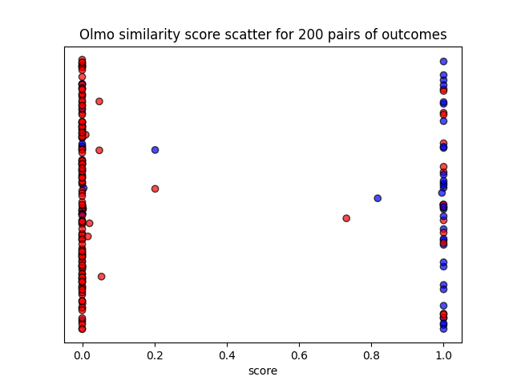
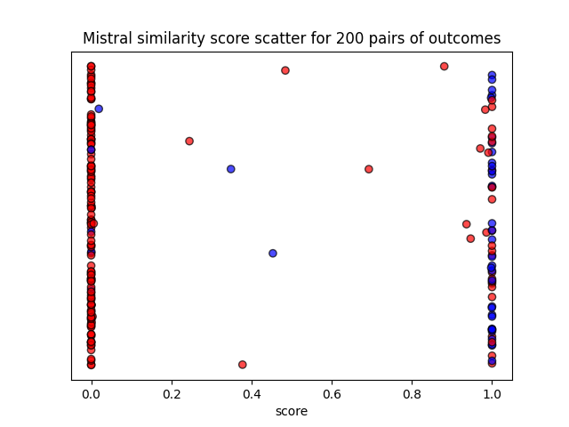
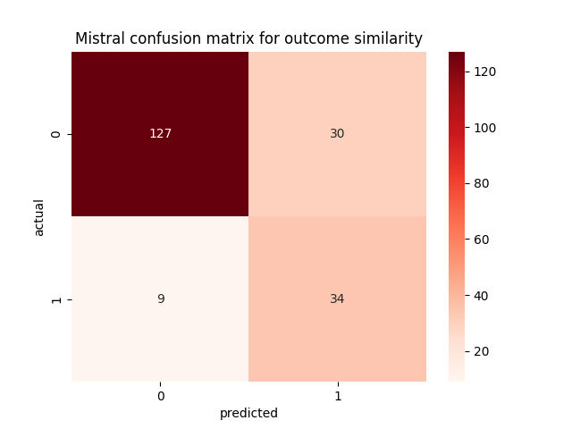
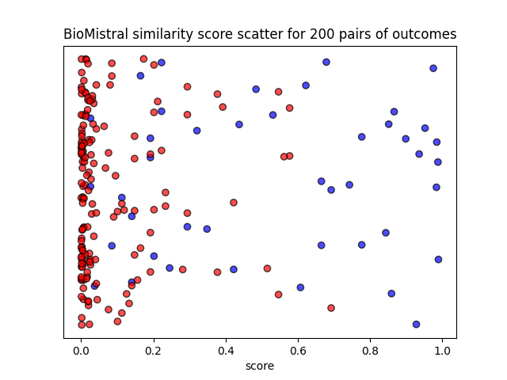
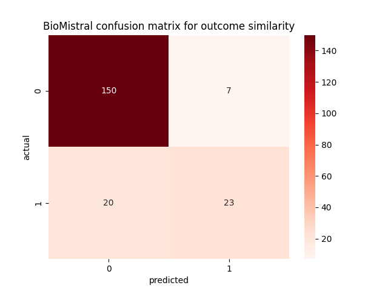
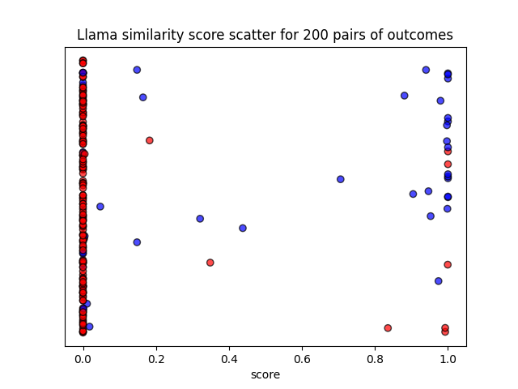

# Detecting spin in clinical trials with large language models


## Language models

### OLMo-7B-Instruct
- Description: **Open training** and weights general purpose model.
- Size: 6.9B parameters
- Release date: February 2024
- Link: [https://huggingface.co/allenai/OLMo-7B-Instruct-hf](https://huggingface.co/allenai/OLMo-7B-Instruct-hf)

### Mistral-7B-Instruct-v0.2
- Description: Open weights general purpose model.
- Size: 7.2B parameters
- Release date: December 2023
- Link: [https://huggingface.co/mistralai/Mistral-7B-Instruct-v0.2](https://huggingface.co/mistralai/Mistral-7B-Instruct-v0.2)

### BioMistral-7B-DARE
- Description: Open weights medical **domain adapted** model.
- Size: 7.2B parameters
- Release date: February 2024
- Link: [https://huggingface.co/BioMistral/BioMistral-7B-DARE](https://huggingface.co/BioMistral/BioMistral-7B-DARE)

### Meta-Llama-3-8B-Instruct
- Description: **State of the art** open weights model.
- Size: 8B parameters
- Release date: April 2024
- Link: [https://huggingface.co/meta-llama/Meta-Llama-3-8B-Instruct](https://huggingface.co/meta-llama/Meta-Llama-3-8B-Instruct)


## Dataset

- Labeled pairs of primary and reported outcomes of PubMed clinical trial abstracts.
- 100 pairs for few shot examples and threshold tuning.
- 2600 pairs for prompt tuning and model evaluation.
- Biased towards **negative examples**, where the reported outcome does not match the primary outcome.

<div style='display: flex; justify-content: center;'>
    
</div>


## Prompt templates

### Zero shot

- Sentence template:
```text
<|endoftext|><|user|>
Are the sentences semantically similar? Answer with either Yes or No.

First sentence: {out1}

Second sentence: {out2}

Answer:
<|assistant|>
```

- Outcome template:
```text
<|endoftext|><|user|>
Does the reported outcome match the defined primary outcome? Answer with either Yes or No.
                                                
Primary outcome: {out1}

Reported outcome: {out2}

Answer:
<|assistant|>
```

- Role template:
```text
<|endoftext|><|user|>
You are a clinical trial report reviewer. Your task is to detect incorrectly reported outcomes.

---

Does the reported outcome match the defined primary outcome? Answer with either Yes or No.
                                                
Primary outcome: {out1}

Reported outcome: {out2}

Answer:
<|assistant|>
```

- Article definition template:
```text
<|endoftext|><|user|>
You are a clinical trial report reviewer. Your task is to detect incorrectly reported outcomes.

---

Outcome switching is an unjustified change of the predefined trial outcomes, leading to reporting only the favourable outcomes that support the hypothesis of the researchers. Outcome switching is one of the most common types of spin. It can consist in omitting the primary outcome in the results and conclusions of the abstract, or in the focus on significant secondary outcomes.

---

Does the reported outcome match the defined primary outcome? Answer with either Yes or No.

Primary outcome: {out1}

Reported outcome: {out2}

Answer:
<|assistant|>
```

- Wikipedia definition template:
```text
<|endoftext|><|user|>
You are a clinical trial report reviewer. Your task is to detect incorrectly reported outcomes.

---

Outcome switching is the practice of changing the primary or secondary outcomes of a clinical trial after its initiation. An outcome is the goal of the clinical trial, such as survival after five years for cancer treatment. Outcome switching can lead to bias and undermine the reliability of the trial, for instance when outcomes are switched after researchers already have access to trial data. That way, researchers can cherry pick an outcome which is statistically significant.

---

Does the reported outcome match the defined primary outcome? Answer with either Yes or No.

Primary outcome: {out1}

Reported outcome: {out2}

Answer:
<|assistant|>
```

- Chain of thought template:
```text
<|endoftext|><|user|>
You are a clinical trial report reviewer. Your task is to detect incorrectly reported outcomes.

---

Does the reported outcome match the defined primary outcome? Lets think step by step.

Primary outcome: {out1}

Reported outcome: {out2}

Steps:
<|assistant|>
```

### One shot

- Random and similar example template:
```text
<|endoftext|><|user|>
You are a clinical trial report reviewer. Your task is to detect incorrectly reported outcomes.

---

Does the reported outcome match the defined primary outcome? Answer with either Yes or No.

Primary outcome: {example_out1}

Reported outcome: {example_out2}

Answer: {example_ans}

---

Does the reported outcome match the defined primary outcome? Answer with either Yes or No.

Primary outcome: {out1}

Reported outcome: {out2}

Answer:
<|assistant|>
```


## Separation results

### Baseline models

| Model                                | Auc score |
|--------------------------------------|-----------|
| Constant classifier                  | 0.500     |
| Random classifier                    | 0.417     |
| Lemmas similarity                    | 0.831     |
| **Stems similarity**                 | **0.871** |
| Levenshtein distance                 | 0.801     |
| Sequence similarity                  | 0.850     |
| Spacy embeddings                     | 0.711     |
| Word2Vec embeddings                  | 0.814     |
| SciBert embeddings                   | 0.782     |
| **Sentence transformers embeddings** | **0.884** |

### Large language models

| Auc score                     | Olmo      | Mistral   | BioMistral | Llama     |
|-------------------------------|-----------|-----------|------------|-----------|
| Sentence template             | 0.897     | 0.878     | **0.893**  | 0.875     |
| Outcome template              | **0.922** | 0.908     | **0.931**  | 0.939     |
| **Role template**             | **0.912** | **0.906** | 0.919      | 0.920     |
| Article definition template   | 0.897     | **0.922** | 0.907      | **0.931** |
| Wikipedia definition template | 0.884     | 0.908     | 0.908      | **0.934** |
| Negative example template     | 0.898     | 0.899     | 0.917      | 0.883     |
| Positive example template     | 0.900     | 0.906     | 0.921      | 0.884     |
| Random example template       | 0.907     | 0.892     | 0.881      | 0.860     |
| Similar example template      | 0.880     | 0.874     | 0.903      | 0.823     |

> **Note**: Model role is a part of the user prompt, except in the case of Llama that uses a dedicated system prompt.

Key takeaways:
- Domain specific BioMistral is most effective with **minimal prompt engineering**.
- State of the art Llama 3 excels at understanding **complex prompts**.
- Olmo and Mistral are relatively **stable** in their predictions.


## Classification results

### Olmo
<div style='display: flex; justify-content: space-between;'>
    
    
</div>

### Mistral
<div style='display: flex; justify-content: space-between;'>
    
    
</div>

### BioMistral
<div style='display: flex; justify-content: space-between;'>
    
    
</div>

### Llama
<div style='display: flex; justify-content: space-between;'>
    
    
</div>

> **Note**: Model bias is corrected by adjusting the threshold based on Youdens J statistic.

### Top models

| Model                                           | Accuracy  | F1 score  |
|-------------------------------------------------|-----------|-----------|
| Stems similarity                                | 0.830     | 0.691     |
| Sentence transformers embeddings                | 0.875     | 0.706     |
| **Olmo role prompt**                            | 0.870     | **0.723** |
| Mistral role prompt                             | 0.810     | 0.642     |
| BioMistral role prompt                          | 0.840     | 0.673     |
| **Llama role prompt**                           | **0.880** | 0.692     |
| **Voting classifier** (Olmo, BioMistral, Llama) | **0.885** | **0.729** |

> **Note**: Combination of diverse language models achieves the highest classification accuracy.

### Mistake analysis

| Primary outcome                                                                                        | Reported outcome                                | Label | Olmo prediction | Mistake interpretation                           |
|--------------------------------------------------------------------------------------------------------|-------------------------------------------------|-------|-----------------|--------------------------------------------------|
| log HbA 1c                                                                                             | glycaemic control                               | 1     | 0               | **model lacks medical terminology**              |
| blood pressure                                                                                         | systolic BP                                     | 0     | 1               | model lacks medical terminology                  |
| difference in plasma bone marker concentration between treatment groups                                | markers of bone formation or resorption         | 0     | 1               | **model lacks reasoning capacity**               |
| intra-operative pain                                                                                   | pain control                                    | 0     | 1               | model lacks reasoning capacity                   |
| 1) defecation frequency > 3/week; 2) normalization of stool consistency; 3) no more painful defecation | painful defecation                              | 0     | 1               | **model accepts less detailed reported outcome** |
| response rates                                                                                         | response rates to a postal health questionnaire | 1     | 0               | model rejects more detailed reported outcome     |
| pain severity and knee range of motion (ROM)                                                           | pain                                            | 0     | 1               | **dataset inconsistency**                        |
| the throughput times length of ED stay (LOS)                                                           | times                                           | 1     | 0               | dataset inconsistency                            |

Key takeaways:
- BioMistral is more effective for examples containing medical terminology.
- Llama is more effective for examples requiring complex reasoning.

### Edge analysis

Adjusted Olmo threshold is 0.1 and examples close to this value are considered to be on the edge of classification.

| Primary outcome                                                                                          | Reported outcome                           | Label | Olmo score | Olmo prediction | Example interpretation |
|----------------------------------------------------------------------------------------------------------|--------------------------------------------|-------|------------|-----------------|------------------------|
| absence of parasites and clinical signs on days 14 and 28, and good clinical and biological tolerability | clinical and parasitological response rate | 0     | 0.020      | 0               | **similar concepts**   |
| the proportion of patients with plasma HIV-1 RNA levels < 200 copies/mL at week 24                       | virologic suppression                      | 0     | 0.047      | 0               | similar concepts       |
| sucrose/pacifier effect on pain reduction                                                                | effective                                  | 0     | 0.053      | 0               | **similar phrases**    |
| improved PFS for the maintenance phase                                                                   | promising PFS                              | 1     | 0.202      | 1               | similar phrases        | 
| health-related quality of life (HRQOL)                                                                   | 6-minute walking distance                  | 0     | 0.202      | 1               | model confusion        |

Key takeaways:
- Olmo edge examples are often based on phrase similarity.
- BioMistral edge examples are often based on concept similarity.

## Explanation results

TODO


## References

- [Measuring semantic similarity of clinical trial outcomes using deep pre-trained language representations](https://www.sciencedirect.com/science/article/pii/S2590177X19300575)
- [SciBERT: A Pretrained Language Model for Scientific Text](https://arxiv.org/abs/1903.10676)
- [A Comprehensive Overview of Large Language Models](https://arxiv.org/abs/2307.06435)
- [OLMo: Accelerating the Science of Language Models](https://arxiv.org/abs/2402.00838)
- [Unleashing the potential of prompt engineering in Large Language Models: a comprehensive review](https://arxiv.org/abs/2310.14735)
- [Large Language Models are Few-Shot Clinical Information Extractors](https://arxiv.org/abs/2205.12689)
- [Analyzing Spin in Abstracts of Orthopaedic Randomized Controlled Trials With Statistically Insignificant Primary Endpoints](https://www.sciencedirect.com/science/article/pii/S0749806320300384?casa_token=646vq-iv8coAAAAA:oVcdcHfVD1GqLqt68JN8XucIxGzKpOyq03dT8xG1sgAV6GIRQgVEQFmyd4O4r5JXHz8ZCenAoQWW)
- [BioMistral: A Collection of Open-Source Pretrained Large Language Models for Medical Domains](https://arxiv.org/abs/2402.10373)
- [COMPare: A prospective cohort study correcting and monitoring 58 misreported trials in real time](https://link.springer.com/article/10.1186/s13063-019-3173-2)
- [Outcome switching](https://en.wikipedia.org/wiki/Outcome_switching)
- [Youdens J statistic](https://en.wikipedia.org/wiki/Youden%27s_J_statistic)
